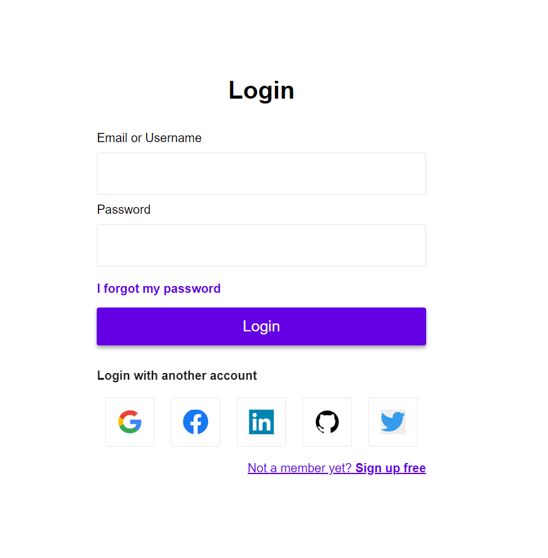

# Simple Login Page
 This repository contains a simple login page built with HTML and CSS.

## Description
This project showcases a basic login page created using HTML and CSS. The login page provides a user interface for users to enter their email/username and password to log in to a system or application.

## Features
* Input fields for email/username and password.
* Submit button for logging in.
* Link to reset forgotten password.
* Social media login options.
* Link to sign up for a new account.
## Screenshots

## Usage
You can explore the login page by opening the index.html file in your web browser. Alternatively, you can deploy the project to a web server or hosting platform to view it online.
